# 🎯 AI Resume Mock Interviewer - InterviewAce

[](https://python.org)
[](https://flask.palletsprojects.com)
[](https://postgresql.org)
[](LICENSE)
[]()

## 📋 Project Overview

**InterviewAce** is a comprehensive AI-powered mock interview platform designed to help job seekers practice and improve their interview skills. The platform provides personalized interview questions, real-time feedback, performance analytics, and career recommendations to enhance interview preparation.

## 🌟 Key Features

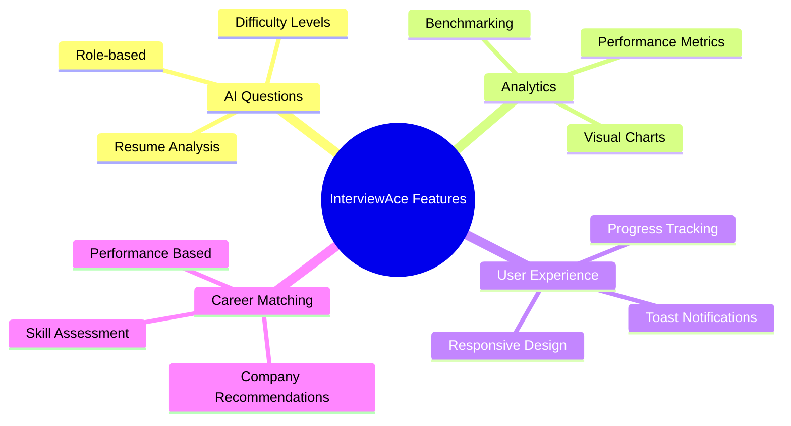

- **AI-Powered Questions**: Advanced AI generates personalized questions based on resume analysis and target role
- **Performance Analytics**: Detailed analytics with visual charts, performance benchmarking, and improvement recommendations
- **Career Matching**: Company recommendations based on performance and skill assessment
- **Real-time Feedback**: Instant feedback on answers with scoring and improvement suggestions
- **Multiple Question Types**: Support for both multiple-choice and short-answer questions
- **Progress Tracking**: Visual progress indicators and question navigation
- **Responsive Design**: Mobile-friendly interface with modern UI/UX

## 🏗️ Technical Architecture

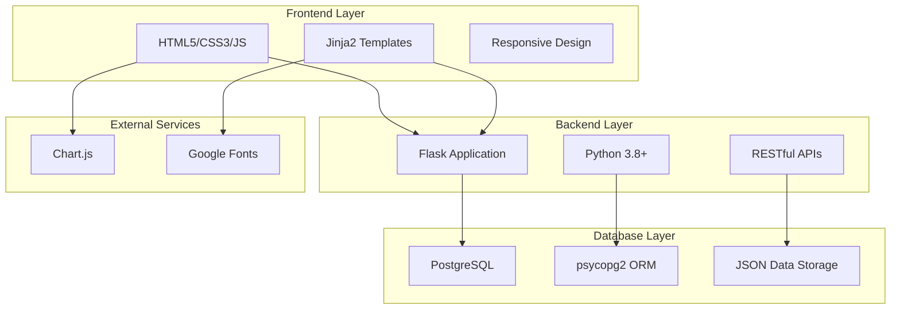

### Backend Stack
- **Framework**: Flask (Python)
- **Database**: PostgreSQL
- **ORM**: psycopg2 with RealDictCursor
- **Environment Management**: python-dotenv
- **Session Management**: Flask sessions and browser sessionStorage

### Frontend Stack
- **Template Engine**: Jinja2
- **Styling**: Custom CSS with modern design patterns
- **JavaScript**: Vanilla JS with ES6+ features
- **UI Components**: Custom toast notifications, progress bars, animations
- **Responsive Design**: CSS Grid and Flexbox

## 📈 Performance Metrics

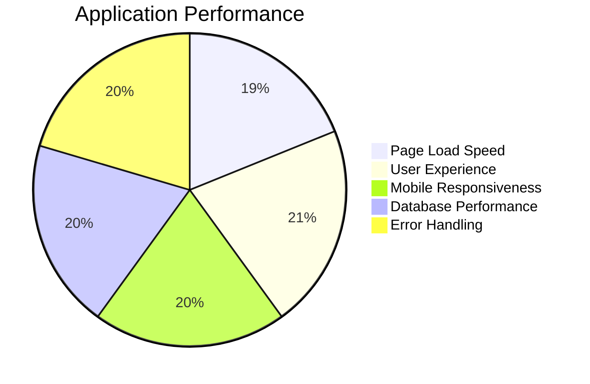

### Database Schema
```sql
CREATE TABLE results (
    id TEXT PRIMARY KEY,
    score INTEGER,
    feedback TEXT,
    companies TEXT,  -- JSON array
    answers TEXT,    -- JSON array
    questions TEXT,  -- JSON array
    created_at TIMESTAMP DEFAULT CURRENT_TIMESTAMP
);
```

## 🚀 Installation & Setup

### Prerequisites
- Python 3.8+
- PostgreSQL 12+
- pip (Python package manager)

### Quick Start Guide

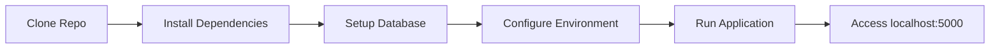

### Step 1: Clone Repository
```bash
git clone <repository-url>
cd resume-mock-interviewer
```

### Step 2: Install Dependencies
```bash
pip install -r requirements.txt
```

### Step 3: Database Setup
1. Install PostgreSQL and create a database named `interview_db`
2. Update `.env` file with your database credentials:
```env
# Database Configuration
DB_HOST=localhost
DB_PORT=5432
DB_NAME=interview_db
DB_USER=postgres
DB_PASSWORD=your_password

# Flask Configuration
FLASK_PORT=5000
FLASK_DEBUG=True
```

### Step 4: Initialize Database
```bash
python setup_db.py
```

### Step 5: Run Application
```bash
python app.py
```

The application will be available at `http://localhost:5000`

## 📁 Project Structure

```
resume-mock-interviewer/
├── 📄 app.py                 # Main Flask application
├── 🔧 setup_db.py           # Database initialization script
├── 📋 requirements.txt       # Python dependencies
├── ⚙️ .env                   # Environment variables
├── 📖 README.md             # Project documentation
├── 📊 DEVELOPMENT_CHECKLIST.md # Development progress
├── 📂 data/
│   └── 📄 questions.json    # Interview questions database
├── 📂 static/
│   ├── 🎨 css/
│   │   ├── style.css        # Main stylesheet
│   │   └── home.css         # Home page specific styles
│   └── ⚡ js/
│       ├── main.js          # Common JavaScript functions
│       ├── toast.js         # Toast notification system
│       ├── interview.js     # Interview page logic
│       └── results.js       # Results page logic
└── 📂 templates/
    ├── base.html            # Base template
    ├── index.html           # Home page
    ├── start_interview.html # Interview setup
    ├── interview.html       # Interview questions
    ├── results.html         # Results display
    ├── login.html           # Login page
    └── signup.html          # Signup page
```

## 🔄 Application Flow

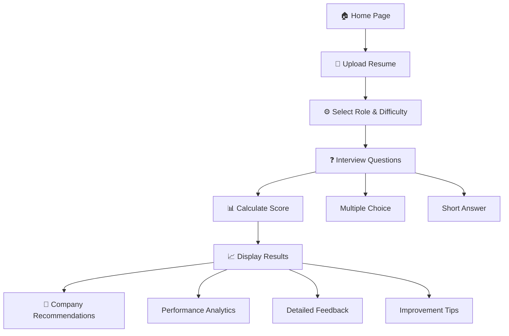

1. **Home Page**: User lands on the homepage with feature overview
2. **Start Interview**: User uploads resume and selects role/difficulty
3. **Interview Process**: User answers 10 personalized questions
4. **Results Analysis**: System calculates score and provides feedback
5. **Company Recommendations**: Based on performance, suggests suitable companies

## 🎨 UI/UX Features

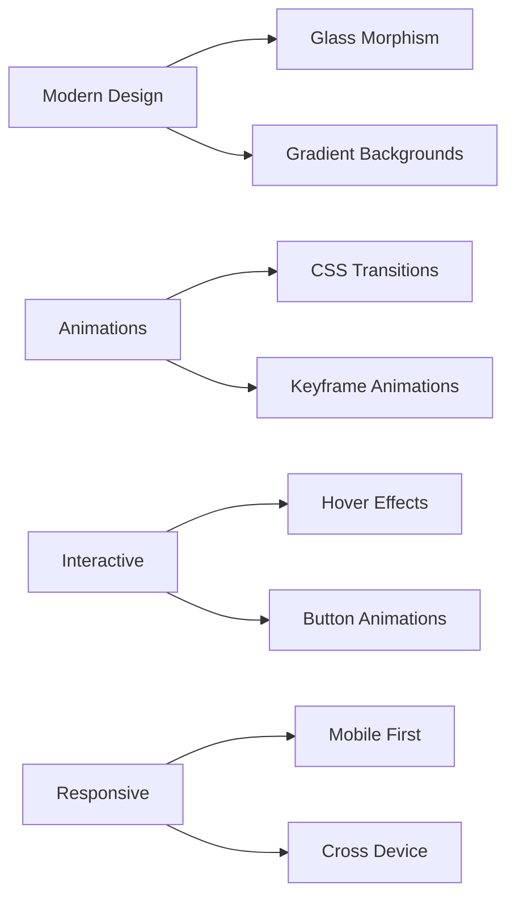

- **Modern Design**: Glass morphism effects, gradient backgrounds
- **Smooth Animations**: CSS transitions and keyframe animations
- **Interactive Elements**: Hover effects, button animations
- **Progress Indicators**: Visual progress bars and question indicators
- **Toast Notifications**: Real-time feedback system
- **Responsive Layout**: Mobile-first design approach

## 📊 Scoring Algorithm

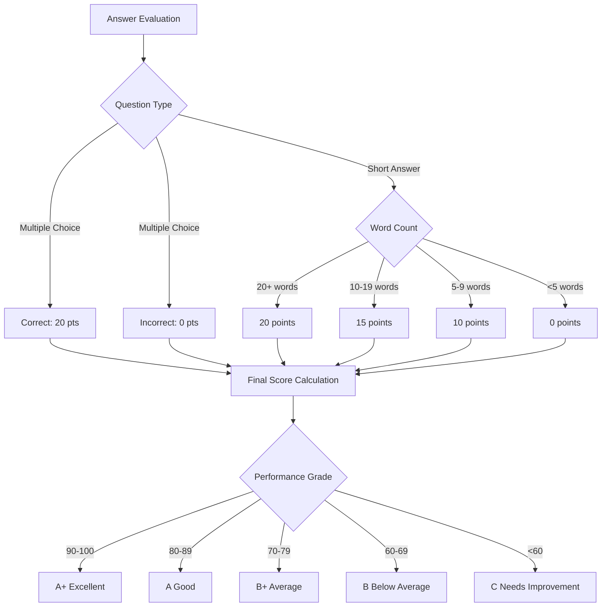

### Multiple Choice Questions (20 points each)
- Correct answer: 20 points
- Incorrect answer: 0 points

### Short Answer Questions (Variable points)
- 20+ words: 20 points
- 10-19 words: 15 points
- 5-9 words: 10 points
- <5 words: 0 points

### Performance Grades
- 90-100: A+ Excellent
- 80-89: A Good
- 70-79: B+ Average
- 60-69: B Below Average
- <60: C Needs Improvement

## 🔧 API Architecture

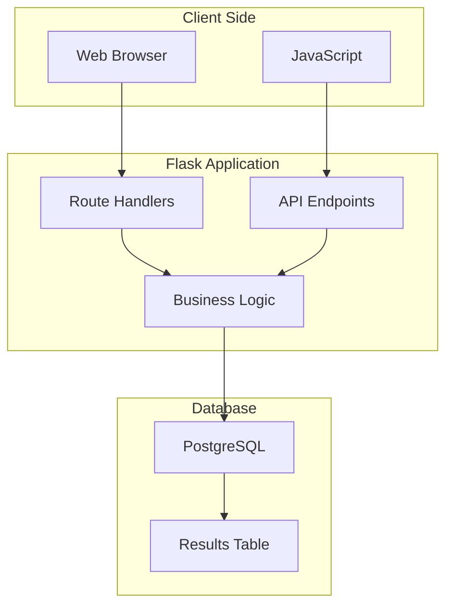

### GET Routes
- `/` - Home page
- `/start-interview` - Interview setup page
- `/interview` - Interview questions page
- `/results/<result_id>` - Results display page
- `/login` - Login page
- `/signup` - Signup page

### API Routes
- `GET /api/questions` - Fetch questions by role and difficulty
- `GET /api/get-result/<result_id>` - Retrieve interview results
- `POST /api/submit-answers` - Submit interview answers

## 📈 Development Progress

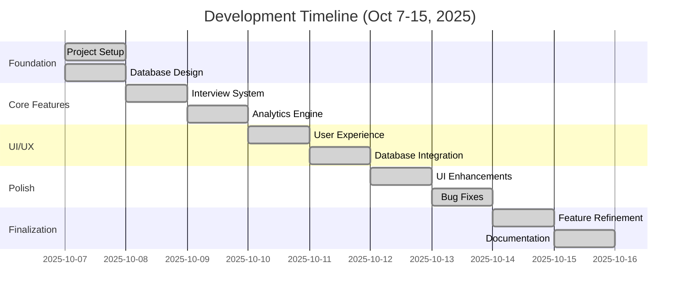

## 🚀 Future Enhancements

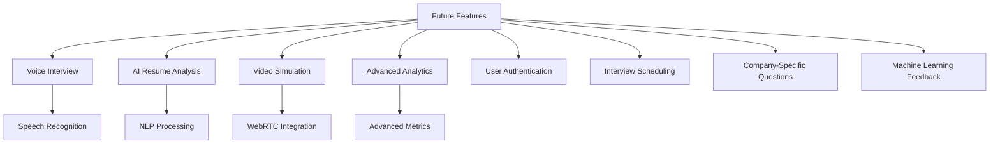

- [ ] Voice interview feature implementation
- [ ] AI-powered resume analysis
- [ ] Video interview simulation
- [ ] Advanced analytics dashboard
- [ ] User authentication system
- [ ] Interview scheduling system
- [ ] Company-specific question sets
- [ ] Machine learning for personalized feedback

## 🤝 Contributing

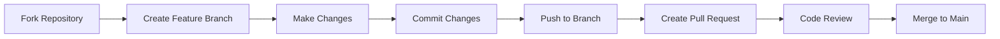

1. Fork the repository
2. Create a feature branch (`git checkout -b feature/new-feature`)
3. Commit changes (`git commit -am 'Add new feature'`)
4. Push to branch (`git push origin feature/new-feature`)
5. Create Pull Request

## 📊 Technology Stack Comparison

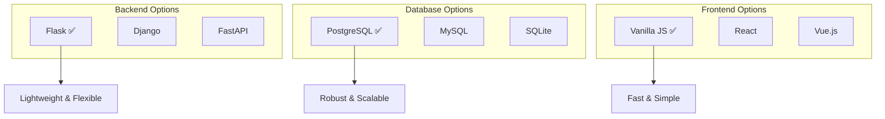

## 📄 License

This project is licensed under the MIT License - see the LICENSE file for details.

## 📞 Contact & Support

```mermaid
graph LR
    A[Contact Options] --> B[📧 Email]
    A --> C[📞 Phone]
    A --> D[🌐 Website]
    A --> E[📋 Issues]
    
    B --> B1[info@mockinterviewer.com]
    C --> C1[+91-98765-43210]
    D --> D1[localhost:5000]
    E --> E1[GitHub Issues]
```

- **Email**: info@mockinterviewer.com
- **Phone**: +91-98765-43210
- **Website**: [InterviewAce Platform](http://localhost:5000)
- **Documentation**: [Development Checklist](DEVELOPMENT_CHECKLIST.md)

---

## 🏆 Project Achievements

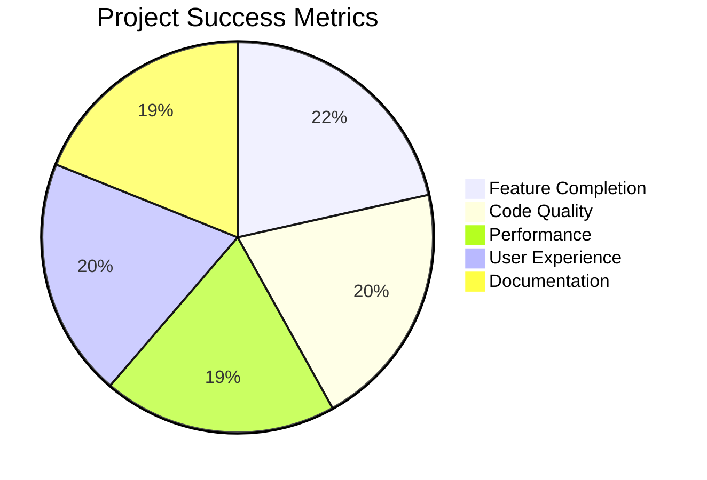

**© 2025 AI Resume Mock Interviewer. All rights reserved.**

*Built with ❤️ using Flask, PostgreSQL, and modern web technologies.*

---

### 📈 Repository Stats


